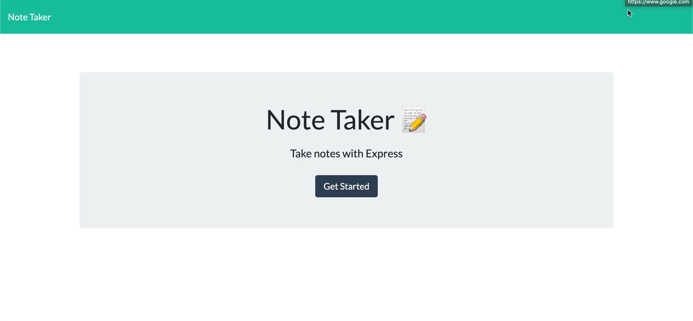

# Note-Taker

## Description
This is a simple note taking application to capture notes and help you stay organized. 




<a href="https://github.com/heather-everton/Note-Taker"><strong>Explore the docs »</strong></a>
<br />
<a href="https://he-notepad.herokuapp.com/">Try It!</a>

## Table of Contents
* [Installation](#installation)
* [Usage](#usage)
* [Contributing](#contributing)
* [Questions](#questions)


## Installation
To install necessary dependencies, run the following command:
```
npm install
npm install inquirer
```
## Usage
    This will allow the user to capture notes and stay organized. It will store your notes and allow you to view previous notes .

## Contributing
If you're interested in contributing please reach out to me via email. 

## Questions
If you have any questions about the repo, open an issue or contact me directly at heathereverton88@gmail.com. You can find more of my work at (https://github.com/heather-everton/).

### Built With
* [JavaScript](https://javascript.com)
* [Node Js](https://nodejs.org/en/)
* [npm](https://www.npmjs.com/)

## Roadmap

See the [open issues](https://github.com/heather-everton/Note-Taker/issues) for a list of proposed features (and known issues).